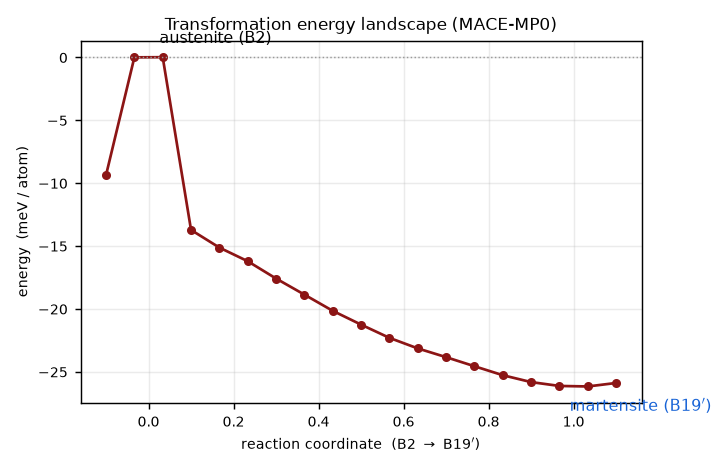

# The B2 to B19' mechanism

Cubic B2 austenite shears and shuffles into monoclinic B19' martensite. The view below looks down the monoclinic b axis, so the B2 square lattice shears into the B19' parallelogram. Slide through the transformation or press play.

:::{anywidget} ./widgets/lattice-morph.js
{ "a_b2": 3.015, "a_m": 2.898, "beta_m": 97.78 }
:::

The defining change is a shear that opens the angle β from 90° to about 98°, with a small shuffle of the atoms. The lattice spacings change by only a few percent. The conventional B19' cell lists b ≈ 4.1 Å and c ≈ 4.6 Å, which look much larger than the B2 edge of 3.0 Å, but those axes map onto face diagonals of the cubic cell (3.0 Å × √2 ≈ 4.24 Å), not its edges. Through the Bain lattice correspondence the actual atomic displacements are small, which is why the transformation is fast and diffusionless.

## Crystallography

| Quantity | B2 austenite | B19' martensite |
|---|---|---|
| Lattice | cubic (CsCl) | monoclinic (P2₁/m) |
| Parameters | a ≈ 3.01 Å | a ≈ 2.90, b ≈ 4.11, c ≈ 4.65 Å, β ≈ 97.8° |
| Symmetry | high | low (several variants) |

Because martensite has lower symmetry, it forms in several crystallographically equivalent variants. Neighboring variants meet on twin boundaries, which accommodate the shape change with little long-range strain. Looking down the B2 ⟨110⟩ directions shows the twin lamellae and atomic shuffles most clearly.

## Energy along the transformation

Relaxing the atoms at each point along the path from austenite to martensite gives the MACE-MP0 energy landscape:

The energy decreases monotonically from B2 to B19', and austenite sits at an energy maximum: at 0 K MACE-MP0 finds B2 to be dynamically unstable, with no barrier protecting it from transforming. This is the well-known result that cubic B2 NiTi is stabilized only by temperature (through its vibrational entropy). It also explains the behavior on this site: the 0 K simulations are one-way (austenite is not metastable, so it shears into martensite and stays), while a reversible superelastic cycle requires the finite-temperature regime where austenite is the stable phase.
